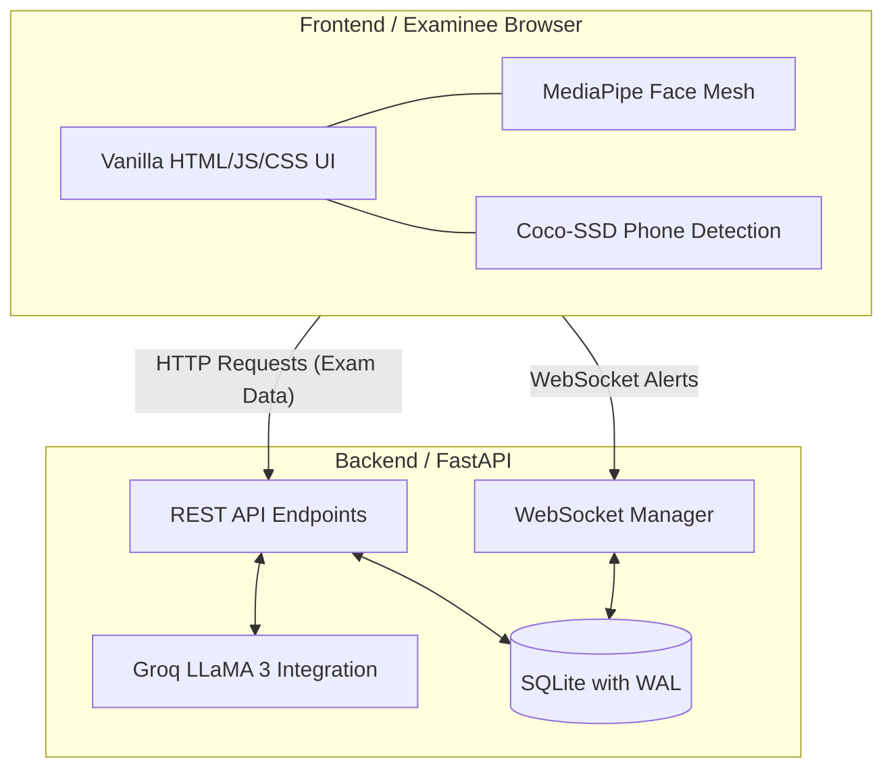

# AssessIQ - Intelligent Examination Platform

AssessIQ is a modern, AI-powered examination platform designed to provide dynamic assessments and ensure academic integrity. It leverages advanced AI models for generating questions, auto-grading subjective answers, and real-time proctoring.

---

### 🚀 Quick Access
- **Live Demo Link**: [assessiq-z5cg.onrender.com](https://assessiq-z5cg.onrender.com)
- **Project Presentation**: [AssessIQ.pptx](./AssessIQ.pptx)

---

## 📌 Problem Statement

Traditional online examination systems face major bottlenecks:
- **Invasive & Heavy Proctoring**: Standard remote proctoring tools stream high-resolution video feeds to central servers. This consumes massive network bandwidth, raises severe privacy concerns, and incurs high server-side GPU costs.
- **Rote Learning & Exam Leakages**: Static question banks make assessments vulnerable to leakages, encouraging rote memorization rather than testing conceptual mastery.
- **Delayed & Biased Evaluation**: Grading subjective or essay-type answers manually is slow, expensive, and prone to human bias, delaying student feedback loops.

---

## 💡 Our Solution

**AssessIQ** redefines online testing by combining client-side machine learning with lightning-fast cloud LLMs:
- **Edge-Based AI Proctoring**: Rather than streaming video feeds, AssessIQ performs real-time face mesh and object detection (like detecting mobile phones) *directly in the user's browser* using MediaPipe and TensorFlow.js. Only lightweight alert packets are sent via WebSockets.
- **Dynamic Exam Generation**: Using advanced LLMs (Llama 3 via Groq / Gemini), the platform generates unique questions on-demand matching specific topics and difficulty levels.
- **Instant AI Auto-Grading**: Subjective answers are analyzed instantly by AI, providing a score out of 10 along with detailed, constructive qualitative feedback.

---

## ⚡ What Makes AssessIQ Different?

| Feature | Traditional Proctoring Platforms | **AssessIQ** |
| :--- | :--- | :--- |
| **Proctoring Load** | High server load (video streaming + cloud GPU analysis) | Zero server video load (runs on client's CPU/GPU via WebGL) |
| **Data Privacy** | Streams raw video feeds to third-party databases/servers | Video stays on client device; only lightweight alert logs are sent |
| **Bandwidth Usage** | High bandwidth required (unstable on poor connections) | Extremely low (lightweight JSON over WebSockets) |
| **Question Variety** | Fixed question pools (prone to answer sharing/leakage) | Fully dynamic, infinite variation tailored to difficulty |
| **Subjective Grading** | Manual grading (takes days, inconsistent results) | Instant AI semantic grading with feedback in <1 second |
| **Setup Cost** | Heavy enterprise setup & subscription fees | Lightweight, dockerized, open-source stack |

---

## Features

- **Dynamic Question Generation**: Automatically generates unique exam questions across various topics and difficulty levels using the Groq API (Llama 3).
- **AI Auto-Grading**: Evaluates subjective, essay-type answers and provides a score out of 10 along with constructive feedback.
- **Real-Time Proctoring**: Client-side analysis using MediaPipe (Face Mesh) and Coco-SSD to detect suspicious behavior directly in the browser, minimizing server load. Utilizes WebSockets to relay lightweight alert payloads to the backend.
- **Full-Stack Architecture**: Built with a robust FastAPI backend and a responsive HTML/CSS/JS frontend.
- **Containerized**: Fully dockerized setup for easy deployment using Docker Compose.

## ⚙️ Core Architecture & Scalability



**Frontend**: HTML/JS/CSS (Vanilla) with Chart.js for visualization.
**Backend**: FastAPI, SQLite, WebSockets for lightweight, real-time alerting.
**AI Integration**: Groq API (Llama 3 models) for instantaneous question generation and subjective grading.

> **Note on Architecture:** For the Hackathon MVP, we are utilizing FastAPI's native `BackgroundTasks` and in-memory LRU caching (`functools`) to guarantee sub-50ms API responses without the deployment overhead of extra containers. In a production environment, this architecture is fully decoupled and ready to scale using **Redis** for distributed caching and **Celery/BullMQ** for asynchronous AI job queues.
## Tech Stack

### Backend
- **Framework**: FastAPI
- **Database**: SQLite with SQLAlchemy ORM
- **Authentication**: JWT authentication with Passlib (Argon2)
- **AI Integrations**: Groq API (Llama-3 models)
- **Computer Vision**: OpenCV, MediaPipe
- **Real-time Communication**: WebSockets

### Frontend
- HTML5, CSS3, Vanilla JavaScript

### Deployment
- Docker, Docker Compose

## Prerequisites

Before you begin, ensure you have met the following requirements:
- Python 3.11+ (if running locally without Docker)
- Docker and Docker Compose (for containerized deployment)
- A Groq API Key for AI features

## Getting Started

### Environment Variables

Create a `.env` file in the `backend/` directory based on the provided `.env.example`:

```env
# AI Model API Keys
GEMINI_API_KEY=your_gemini_api_key_here
GROK_API_KEY=your_groq_api_key_here

# Database Configuration
DATABASE_URL=sqlite:///./assessiq.db

# App Settings
SECRET_KEY=your_secret_key_here
DEBUG=True
```

*Note: The project primarily uses `GROK_API_KEY` for Groq integrations.*

### Running with Docker (Recommended)

The easiest way to run AssessIQ is using Docker Compose. This will build both the frontend and backend into a single container and expose the necessary ports.

1. Ensure Docker is running on your machine.
2. Build and start the container:
   ```bash
   docker-compose up -d --build
   ```
3. The application will be available at: `http://localhost:8085`

### Running Locally (Without Docker)

1. Navigate to the backend directory:
   ```bash
   cd backend
   ```
2. Install the required dependencies:
   ```bash
   pip install -r requirements.txt
   ```
3. Initialize the database with mock data:
   ```bash
   python init_db.py
   ```
4. Start the FastAPI server:
   ```bash
   uvicorn main:app --host 0.0.0.0 --port 8085 --reload
   ```
5. The application will be available at: `http://localhost:8085` (The frontend is served directly by the FastAPI backend).

## API Endpoints

- `GET /api/status`: Check the status of the API.
- `POST /api/auth/login`: Authenticate user and receive JWT token.
- `POST /api/auth/register`: Register a new user account.
- `GET /api/exams`: Retrieve a list of all available exams.
- `GET /api/questions?topic={topic}&difficulty={difficulty}`: Generate exam questions dynamically.
- `POST /api/grade`: Auto-grade subjective and essay-type answers.
- `POST /api/exam/start`: Start an exam session.
- `POST /api/exam/autosave`: Autosave exam answers.
- `POST /api/exam/terminate`: Terminate an exam due to security violations.
- `WS /ws/proctoring`: WebSocket endpoint for real-time video frame analysis.

## Project Structure

```
.
├── backend/
│   ├── .env.example        # Example environment variables
│   ├── auth.py             # JWT authentication and user management
│   ├── config.py           # Application configuration settings
│   ├── database.py         # Database connection setup
│   ├── grading.py          # AI auto-grading and question generation logic
│   ├── init_db.py          # Script to initialize database with mock data
│   ├── main.py             # FastAPI entry point and routing
│   ├── models.py           # SQLAlchemy database models
│   ├── proctoring.py       # Computer vision logic for proctoring
│   └── requirements.txt    # Python dependencies
├── frontend/
│   ├── app.js              # Frontend logic
│   ├── index.html          # Main web interface
│   └── styles.css          # UI styling
├── docker-compose.yml      # Docker Compose configuration
├── Dockerfile              # Docker image definition
└── test_groq.py            # Test script for Groq API integration
```

## License

This project is open-source and available under the [MIT License](LICENSE).
